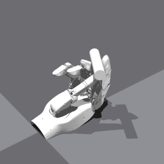
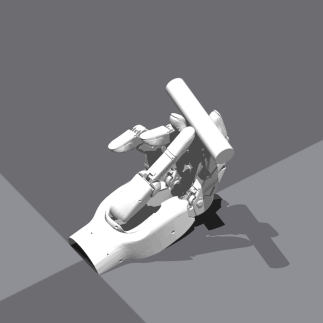

1 23    
    Hand: [0.09058664739131927, -1.1684951782226562, -0.3523995876312256, -0.5262272953987122, -0.13673382997512817, -1.0198190212249756, -0.9558137059211731, -1.2512168884277344, -3.8383831224564346e-07, -1.3491917848587036, -0.5089983940124512, -0.3240099549293518, -0.05116431415081024, -0.9247583150863647, -1.2445602416992188, -0.9097212553024292, -0.020588409155607224, -1.1557494401931763, -0.7035709023475647, -0.2180664837360382, -0.001244630548171699]
    Object: [-0.11762521415948868, 0.023072263225913048, 0.18054848909378052, 0.708649218082428, 0.021436162292957306, 0.03619061037898064, -0.7043059468269348]

    "hand_dof_targets_rad": [0.09058664739131927, -1.1684951782226562, -0.3523995876312256, -0.5262272953987122, -0.13673382997512817, -1.0198190212249756, -0.9558137059211731, -1.2512168884277344, -3.8383831224564346e-07, -1.3491917848587036, -0.5089983940124512, -0.3240099549293518, -0.05116431415081024, -0.9247583150863647, -1.2445602416992188, -0.9097212553024292, -0.020588409155607224, -1.1557494401931763, -0.7035709023475647, -0.2180664837360382, -0.001244630548171699],
    # !! 修改这里的值来设置物体的初始位置 [x, y, z] (米) !!
    "object_initial_pos": [-0.11762521415948868, 0.023072263225913048, 0.18054848909378052],
    # !! 修改这里的值来设置物体的初始旋转 (四元数) !!
    "object_initial_rot": [0.708649218082428, 0.021436162292957306, 0.03619061037898064, -0.7043059468269348],
    
12 3
    Hand: [0.17996101081371307, -1.2075750827789307, -0.3885318338871002, -0.4472368657588959, -0.17998147010803223, -1.030931830406189, -0.910559356212616, -1.1463258266448975, -1.9397666051190754e-07, -1.2313501834869385, -0.6338013410568237, -0.4614178240299225, -0.08347102254629135, -0.8618580102920532, -1.1939127445220947, -0.8964090943336487, 0.17496797442436218, -1.3870528936386108, -0.6740223169326782, -0.21953974664211273, -0.0016594172921031713]
    Object: [-0.10668071359395981, 0.021574808284640312, 0.17717039585113525, 0.21597789227962494, -0.6708014011383057, 0.2683640122413635, -0.6567798256874084]
    
    "hand_dof_targets_rad": [0.17949999868869781, -1.2080999612808228, -0.3971000015735626, -0.5027999877929688, -0.18000000715255737, -1.0195000171661377, -0.8944000005722046, -1.1978000402450562, 0.0, -1.2235000133514404, -0.5444999933242798, -0.40639999508857727, -9.999999747378752e-05, -0.9298999905586243, -1.2790000438690186, -0.9383000135421753, 0.11150000244379044, -1.3601000308990479, -0.699400007724762, -0.2565000057220459, -0.0364999994635582],
    # !! 修改这里的值来设置物体的初始位置 [x, y, z] (米) !!
    "object_initial_pos": [-0.1124000060558319, 0.03090000070631504, 0.19130000722408295],
    # !! 修改这里的值来设置物体的初始旋转 (四元数) !!
    "object_initial_rot": [0.44620001316070557, -0.5485000014305115, 0.5485000014305115, -0.44620001316070557],
    
13 2    
    Hand: [0.12977235019207, -0.9924959540367126, -0.3606451451778412, -0.4871084988117218, -0.17996357381343842, -1.1815704107284546, -1.0074188709259033, -1.063124179840088, -1.3303166213063378e-07, -1.1750483512878418, -0.5964861512184143, -0.7107267379760742, -0.0033535510301589966, -0.8607388734817505, -1.2455166578292847, -0.8664445281028748, -0.02050342597067356, -1.1381360292434692, -0.7652751803398132, -0.32268959283828735, -0.03381062299013138]
    Object: [-0.1360439658164978, 0.02780270390212536, 0.16825813055038452, -0.3405953049659729, -0.6889249086380005, 0.5953956842422485, -0.23426729440689087]

    "hand_dof_targets_rad": [0.0818849429488182, -1.0597257614135742, -0.3524025082588196, -0.43930837512016296, -0.17942748963832855, -1.1079117059707642, -0.9490943551063538, -1.159927248954773, -1.4911061896327737e-07, -1.2497045993804932, -0.6281847357749939, -0.7378029227256775, -0.07730768620967865, -0.8657478094100952, -1.2482352256774902, -0.8412582278251648, -0.020546605810523033, -1.1522892713546753, -0.698004424571991, -0.23692040145397186, -0.04038155823945999],
    # !! 修改这里的值来设置物体的初始位置 [x, y, z] (米) !!
    "object_initial_pos": [-0.12677642703056335, 0.02324432134628296, 0.16491705179214478],
    # !! 修改这里的值来设置物体的初始旋转 (四元数) !!
    "object_initial_rot": [-0.1328931599855423, -0.741683304309845, 0.6311578154563904, -0.184078648686409],
    

{'hand': [0.09058664739131927, -1.1684951782226562, -0.3523995876312256, -0.5262272953987122, -0.13673382997512817, -1.0198190212249756, -0.9558137059211731, -1.2512168884277344, -3.8383831224564346e-07, -1.3491917848587036, -0.5089983940124512, -0.3240099549293518, -0.05116431415081024, -0.9247583150863647, -1.2445602416992188, -0.9097212553024292, -0.020588409155607224, -1.1557494401931763, -0.7035709023475647, -0.2180664837360382, -0.001244630548171699],
'object': [-0.11762521415948868, 0.023072263225913048, 0.18054848909378052, 0.708649218082428, 0.021436162292957306, 0.03619061037898064, -0.7043059468269348]},
{'hand': [0.17996101081371307, -1.2075750827789307, -0.3885318338871002, -0.4472368657588959, -0.17998147010803223, -1.030931830406189, -0.910559356212616, -1.1463258266448975, -1.9397666051190754e-07, -1.2313501834869385, -0.6338013410568237, -0.4614178240299225, -0.08347102254629135, -0.8618580102920532, -1.1939127445220947, -0.8964090943336487, 0.17496797442436218, -1.3870528936386108, -0.6740223169326782, -0.21953974664211273, -0.0016594172921031713],
'object': [-0.10668071359395981, 0.021574808284640312, 0.17717039585113525, 0.21597789227962494, -0.6708014011383057, 0.2683640122413635, -0.6567798256874084]},
{'hand': [0.12977235019207, -0.9924959540367126, -0.3606451451778412, -0.4871084988117218, -0.17996357381343842, -1.1815704107284546, -1.0074188709259033, -1.063124179840088, -1.3303166213063378e-07, -1.1750483512878418, -0.5964861512184143, -0.7107267379760742, -0.0033535510301589966, -0.8607388734817505, -1.2455166578292847, -0.8664445281028748, -0.02050342597067356, -1.1381360292434692, -0.7652751803398132, -0.32268959283828735, -0.03381062299013138],
'object': [-0.1360439658164978, 0.02780270390212536, 0.16825813055038452, -0.3405953049659729, -0.6889249086380005, 0.5953956842422485, -0.23426729440689087]},
