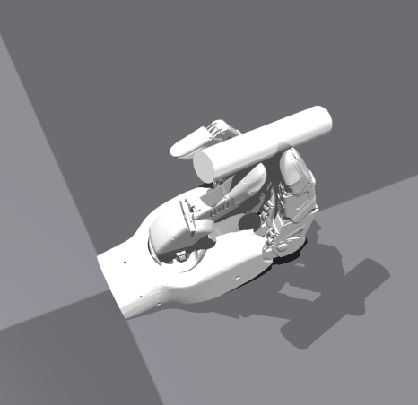
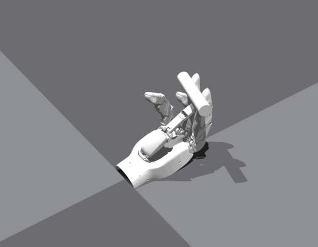

1 2345
                {'hand': [0.12453551590442657, -1.3983227014541626, -0.03729098662734032, -0.6903106570243835, -0.12674453854560852, -1.3707561492919922, -0.35772815346717834, -0.5420524477958679, -1.03192556721865e-08, -1.3883659839630127, -0.16317471861839294, -0.4754868745803833, -0.024602990597486496, -1.4065502882003784, 1.0915914572251495e-06, -0.6129568219184875, -0.30466559529304504, -1.4296414852142334, -0.23149807751178741, -0.5501845479011536, -0.34258005023002625],
                 'object': [-0.11171458661556244, -0.003700472181662917, 0.1771288514137268, -0.6131685376167297, -0.011775919236242771, 0.10527353733778, 0.7828174233436584]},

             
    # --- 手部姿态 (21 个自由度) ---
    "hand_dof_targets_rad": [0.0500, -1.3888, 0.0000, -0.7288, -0.1611, -1.3003, -0.3180, -0.4468, 0.0322, -1.4130, -0.2456, -0.3905, -0.1203, -1.5177, -0.0121, -0.5515, -0.2753, -1.4043, -0.1731, -0.5193, -0.4388],
    # !! 修改这里的值来设置物体的初始位置 [x, y, z] (米) !!
    "object_initial_pos": [-0.10570000112056732, 0.0013000000035390258, 0.1834000051021576, -0.703499972820282, -0.061799999326467514, 0.0737999975681305, 0.704200029373169],
    # !! 修改这里的值来设置物体的初始旋转 (四元数) !!
    "object_initial_rot": [-0.703499972820282, -0.061799999326467514, 0.0737999975681305, 0.704200029373169],
    
12 34
               {'hand': [0.12453551590442657, -1.3983227014541626, -0.03729098662734032, -0.6903106570243835, -0.12674453854560852, -1.3707561492919922, -0.35772815346717834, -0.5420524477958679, -1.03192556721865e-08, -1.3883659839630127, -0.16317471861839294, -0.4754868745803833, -0.024602990597486496, -1.4065502882003784, 1.0915914572251495e-06, -0.6129568219184875, -0.30466559529304504, -1.4296414852142334, -0.23149807751178741, -0.5501845479011536, -0.34258005023002625],
 '                object': [-0.11171458661556244, -0.003700472181662917, 0.1771288514137268, -0.6131685376167297, -0.011775919236242771, 0.10527353733778, 0.7828174233436584]},

    # --- 手部姿态 (21 个自由度) ---
    "hand_dof_targets_rad": [0.1232, -1.0181, -0.3928, -0.3261, -0.1048, -1.4346, -0.3308, -0.1006, 0.0000, -1.2117, -0.0258, -0.5515, -0.0171, -1.5418, 0.0000, -0.3180, -0.6054, -1.2055, -0.1381, -0.5270, -0.2650],    # --- 物体姿态与缩放 ---
    # !! 修改这里的值来设置物体的初始位置 [x, y, z] (米) !!
    "object_initial_pos": [-0.12370000034570694, 0.007899999618530273, 0.18170000612735748],
    # !! 修改这里的值来设置物体的初始旋转 (四元数) !!
    "object_initial_rot": [-0.12370000034570694, 0.007899999618530273, 0.18170000612735748, -0.6355999708175659, -0.24799999594688416, 0.4408999979496002, 0.583299994468689],
    
12 3
    {'hand': [0.17996101081371307, -1.2075750827789307, -0.3885318338871002, -0.4472368657588959, -0.17998147010803223, -1.030931830406189, -0.910559356212616, -1.1463258266448975, -1.9397666051190754e-07, -1.2313501834869385, -0.6338013410568237, -0.4614178240299225, -0.08347102254629135, -0.8618580102920532, -1.1939127445220947, -0.8964090943336487, 0.17496797442436218, -1.3870528936386108, -0.6740223169326782, -0.21953974664211273, -0.0016594172921031713],
                 'object': [-0.10668071359395981, 0.021574808284640312, 0.17717039585113525, 0.21597789227962494, -0.6708014011383057, 0.2683640122413635, -0.6567798256874084]},
               
    
    "hand_dof_targets_rad": [0.17949999868869781, -1.2080999612808228, -0.3971000015735626, -0.5027999877929688, -0.18000000715255737, -1.0195000171661377, -0.8944000005722046, -1.1978000402450562, 0.0, -1.2235000133514404, -0.5444999933242798, -0.40639999508857727, -9.999999747378752e-05, -0.9298999905586243, -1.2790000438690186, -0.9383000135421753, 0.11150000244379044, -1.3601000308990479, -0.699400007724762, -0.2565000057220459, -0.0364999994635582],
    # !! 修改这里的值来设置物体的初始位置 [x, y, z] (米) !!
    "object_initial_pos": [-0.1124000060558319, 0.03090000070631504, 0.19130000722408295],
    # !! 修改这里的值来设置物体的初始旋转 (四元数) !!
    "object_initial_rot": [0.44620001316070557, -0.5485000014305115, 0.5485000014305115, -0.44620001316070557],
    
13 24
    {'hand': [0.18000002205371857, -1.0464586019515991, -0.41268664598464966, -0.41177529096603394, -0.17681774497032166, -1.3315761089324951, -0.3797590732574463, -0.5883009433746338, -2.8795298590011953e-07, -1.0698927640914917, -0.7280430793762207, -0.5705047249794006, -0.0002597713319119066, -0.9266747832298279, -0.26815065741539, -0.3203774094581604, 0.1648491472005844, -1.0737873315811157, -0.6846374273300171, -0.41734376549720764, -0.5779910683631897],
    'object': [-0.13613660633563995, 0.01893787458539009, 0.16901230812072754, -0.5389097929000854, -0.5710364580154419, 0.5835363864898682, -0.20731335878372192]},
             
    
    