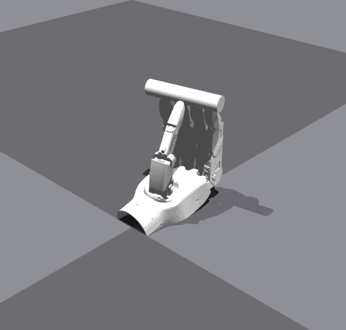
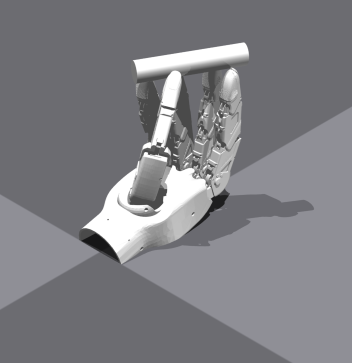
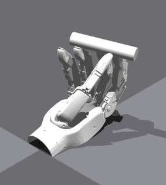
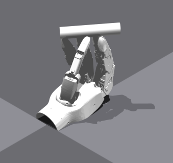
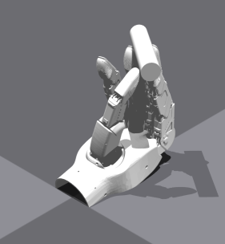
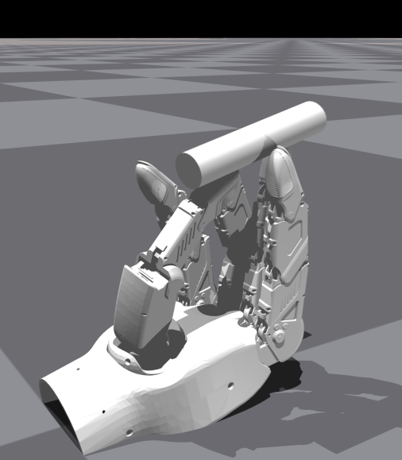

1 2345
    # --- 手部姿态 (21 个自由度) ---
    "hand_dof_targets_rad": [0.0500, -1.3888, 0.0000, -0.7288, -0.1611, -1.3003, -0.3180, -0.4468, 0.0322, -1.4130, -0.2456, -0.3905, -0.1203, -1.5177, -0.0121, -0.5515, -0.2753, -1.4043, -0.1731, -0.5193, -0.4388],
    # !! 修改这里的值来设置物体的初始位置 [x, y, z] (米) !!
    "object_initial_pos": [-0.10570000112056732, 0.0013000000035390258, 0.1834000051021576],
    # !! 修改这里的值来设置物体的初始旋转 (四元数) !!
    "object_initial_rot": [-0.703499972820282, -0.061799999326467514, 0.0737999975681305, 0.704200029373169],
    
12 34
    # --- 手部姿态 (21 个自由度) ---
    "hand_dof_targets_rad": [0.1232, -1.0181, -0.3928, -0.3261, -0.1048, -1.4346, -0.3308, -0.1006, 0.0000, -1.2117, -0.0258, -0.5515, -0.0171, -1.5418, 0.0000, -0.3180, -0.6054, -1.2055, -0.1381, -0.5270, -0.2650],    # --- 物体姿态与缩放 ---
    # !! 修改这里的值来设置物体的初始位置 [x, y, z] (米) !!
    "object_initial_pos": [-0.12370000034570694, 0.007899999618530273, 0.18170000612735748],
    # !! 修改这里的值来设置物体的初始旋转 (四元数) !!
    "object_initial_rot": [-0.6355999708175659, -0.24799999594688416, 0.4408999979496002, 0.583299994468689],
    
14 23
    # --- 手部姿态 (21 个自由度) ---
    "hand_dof_targets_rad": [0.1342, -0.7031, -0.6790, -0.7206, -0.1149, -1.4346, -0.3308, -0.5274, 0.0000, -0.9380, -0.6803, -0.3905, -0.1203, -1.4211, -0.1409, -0.8816, -0.3629, -0.9057, -0.5435, -0.2617, -0.0926],
    # !! 修改这里的值来设置物体的初始位置 [x, y, z] (米) !!
    "object_initial_pos": [-0.1316000074148178, 0.028599999845027924, 0.17080000042915344],
    # !! 修改这里的值来设置物体的初始旋转 (四元数) !!
    "object_initial_rot": [0.7116000056266785, 0.15160000324249268, -0.0754999965429306, -0.818000078201294],
    
12 345
    "hand_dof_targets_rad": [0.08720000088214874, -1.2644000053405762, -0.43529999256134033, -0.3336000144481659, -0.04569999873638153, -1.542099952697754, -0.33009999990463257, -0.2768000066280365, -0.0, -1.11489999294281, -0.5781000256538391, -0.39469999074935913, -0.16590000689029694, -1.4716999530792236, -0.23510000109672546, -0.40630000829696655, -0.30000001192092896, -1.2889000177383423, -0.07580000162124634, -0.5429999828338623, -0.7644000053405762],
    # !! 修改这里的值来设置物体的初始位置 [x, y, z] (米) !!
    "object_initial_pos": [-0.11110000312328339, 0.010499999858438969, 0.1800999939441681],
    # !! 修改这里的值来设置物体的初始旋转 (四元数) !!
    "object_initial_rot": [-0.6158999800682068, -0.2865000069141388, 0.2554999887943268, 0.6880000233650208],
    
14 3
    "hand_dof_targets_rad": [0.0586, -1.4211, -0.3663, -0.2375, -0.1029, -1.4346, -0.3308, -0.4710, 0.0000, -1.4082, -0.1162, -0.2456, -0.0789, -1.4604, -0.0845, -0.4009, 0.0501, -1.2797, -0.1892, -0.0523, -0.8253],
    # !! 修改这里的值来设置物体的初始位置 [x, y, z] (米) !!
    "object_initial_pos": [-0.10760000348091125, 0.02160000056028366, 0.1826000064611435],
    # !! 修改这里的值来设置物体的初始旋转 (四元数) !!
    "object_initial_rot": [-0.26589998602867126, -0.6491000056266785, 0.6674000024795532, 0.25],
    
12 3
    "hand_dof_targets_rad": [0.15313394367694855, -1.227587103843689, -0.14623278379440308, -0.4975071847438812, -0.14450642466545105, -1.4362249374389648, -0.41045892238616943, -0.5124778747558594, 1.137278502483241e-07, -1.1985440254211426, -0.04357815161347389, -0.2830646336078644, -0.022337475791573524, -1.065238118171692, -0.6658048629760742, -0.08125004917383194, -0.20511280000209808, -1.2077994346618652, -0.15164703130722046, -0.7075797319412231, -0.621982753276825]
    "object_initial"[-0.1323818415403366, 0.02592412196099758, 0.17928411066532135, 0.20689649879932404, -0.7517358660697937, 0.10590769350528717, -0.6171471476554871]
    

